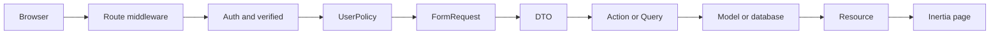
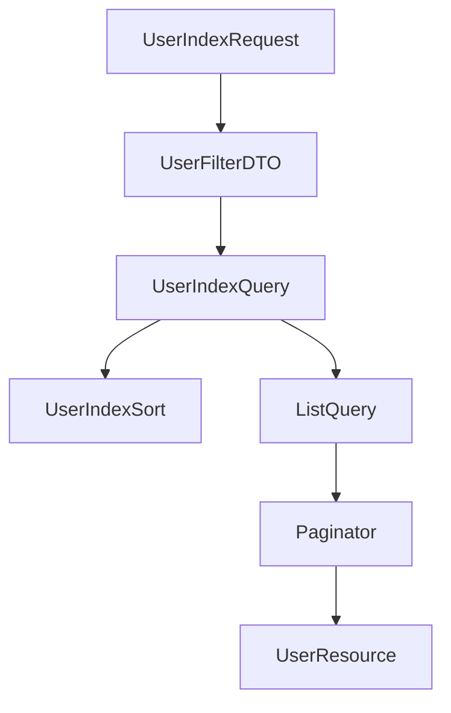

# Quản lý người dùng Admin

Tài liệu này mô tả tính năng quản lý người dùng trong khu vực Admin. Phase hiện tại
dùng cột boolean `users.is_admin` làm security boundary. Hệ thống chưa triển khai
roles/permissions động; các khái niệm đó chỉ là hướng mở rộng cho phase sau.

## 1. Mục tiêu và phạm vi

Admin có thể:

- Xem danh sách người dùng.
- Tìm kiếm theo tên hoặc email.
- Lọc theo quyền admin, locale, timezone và trạng thái xóa.
- Sắp xếp theo các cột được whitelist.
- Chọn số bản ghi mỗi trang.
- Tạo người dùng.
- Cập nhật thông tin người dùng.
- Cấp hoặc thu hồi quyền admin.
- Soft delete, restore và bulk action.

Các nguyên tắc bắt buộc:

- Guest không thể truy cập.
- User chưa verified không thể truy cập.
- User thường không thể truy cập.
- Policy backend là ranh giới bảo mật cuối cùng; UI chỉ là lớp trải nghiệm.
- Không được tự hạ quyền admin hoặc tự xóa chính mình.
- Không được xóa admin cuối cùng.
- Dữ liệu nhạy cảm không được trả về frontend.

## 2. Request flow tổng thể



### Vai trò từng lớp

| Lớp             | Trách nhiệm                                           | Không nên làm                       |
| --------------- | ----------------------------------------------------- | ----------------------------------- |
| Route           | Xác định endpoint và middleware                       | Chứa business logic                 |
| Policy          | Quyết định quyền truy cập resource                    | Render UI hoặc xử lý transaction    |
| Form Request    | Validate input và authorize request                   | Cập nhật database                   |
| DTO             | Chuyển input đã validate thành object có kiểu rõ ràng | Đọc trực tiếp request trong Action  |
| Action          | Thực hiện một use case mutation                       | Xử lý HTML/UI                       |
| Query           | Xây dựng read model cho index                         | Mutate dữ liệu                      |
| Model           | Mapping, cast và scope nghiệp vụ nhỏ                  | Chứa toàn bộ logic của mọi màn hình |
| Resource        | Chọn và định dạng dữ liệu trả về                      | Trả toàn bộ model                   |
| React component | Render và điều khiển trải nghiệm                      | Là security boundary                |

## 3. Cấu trúc source

```text
app/
├── Actions/Admin/Users/
│   ├── CreateUser.php
│   ├── UpdateUser.php
│   ├── DeleteUser.php
│   ├── RestoreUser.php
│   ├── ForceDeleteUser.php
│   ├── BulkDeleteUsers.php
│   ├── BulkRestoreUsers.php
│   └── BulkForceDeleteUsers.php
├── DTOs/Admin/Users/
│   ├── UserDTO.php
│   └── UserFilterDTO.php
├── Http/
│   ├── Controllers/Admin/Users/UserController.php
│   ├── Requests/Admin/Users/
│   │   ├── StoreUserRequest.php
│   │   ├── UpdateUserRequest.php
│   │   ├── UserIndexRequest.php
│   │   ├── BulkDestroyUsersRequest.php
│   │   ├── BulkRestoreUsersRequest.php
│   │   └── BulkForceDeleteUsersRequest.php
│   └── Resources/Admin/UserResource.php
├── Policies/UserPolicy.php
├── Queries/Admin/Users/
│   ├── UserIndexQuery.php
│   └── UserIndexSort.php
└── Support/Listing/
    ├── ListFilterRules.php
    ├── ListQuery.php
    └── ListQueryOptions.php

resources/js/
├── components/admin/
│   ├── users/user-form.tsx
│   ├── data-table.tsx
│   ├── admin-list-toolbar.tsx
│   ├── bulk-action-bar.tsx
│   ├── pagination-nav.tsx
│   └── confirm-dialog.tsx
├── pages/admin/users/
│   ├── index.tsx
│   ├── create.tsx
│   └── edit.tsx
└── types/admin/
    ├── users.ts
    └── pagination.ts
```

`components/admin/users/user-form.tsx` là component riêng của User. Các component
ở cấp `components/admin` chỉ nên chứa primitive dùng được cho nhiều resource.

## 4. Authentication và authorization

Route được bảo vệ theo thứ tự:

```text
auth → verified → can:viewAny,User
```

`User` implement `MustVerifyEmail`, vì vậy middleware `verified` thực sự hoạt động.

Policy hiện có:

| Ability          | Ý nghĩa                                |
| ---------------- | -------------------------------------- |
| `viewAny`        | Được mở màn hình danh sách             |
| `view`           | Được xem form/detail của user          |
| `create`         | Được tạo user                          |
| `update`         | Được cập nhật user                     |
| `delete`         | Được soft delete user                  |
| `restore`        | Được khôi phục user đã xóa             |
| `forceDelete`    | Được xóa vĩnh viễn user đã soft delete |
| `deleteAny`      | Được bulk soft delete                  |
| `restoreAny`     | Được bulk restore                      |
| `forceDeleteAny` | Được bulk force delete                 |

Policy kiểm tra quyền cơ bản. Các invariant có tính transaction như admin cuối cùng
được kiểm tra lại trong Action để không bị bypass qua endpoint khác, job hoặc CLI.

Không được chỉ ẩn button ở React để bảo vệ endpoint. Mọi request phải vẫn an toàn
khi được gọi trực tiếp bằng HTTP client.

## 5. CRUD và Action

Mỗi mutation là một use case riêng:

```text
CreateUser
UpdateUser
DeleteUser
RestoreUser
ForceDeleteUser
BulkDeleteUsers
BulkRestoreUsers
BulkForceDeleteUsers
```

Action dùng transaction khi cần nhiều bước hoặc cần bảo vệ invariant đồng thời.
Bulk action khóa các row liên quan bằng `lockForUpdate()` và xác minh lại dữ liệu
trước khi thay đổi.

### Password

- Create: password bắt buộc.
- Update: password có thể bỏ trống để giữ password cũ.
- Nếu nhập confirm password mà bỏ trống password mới, frontend và backend đều báo lỗi.
- Password được cast bằng `hashed` của Eloquent.

### Email

Nếu email thay đổi, `email_verified_at` được reset về `null` để yêu cầu xác minh lại.

### Soft delete

Admin delete chỉ gọi `delete()`. User vẫn còn trong database và có thể restore.

Force delete là thao tác nguy hiểm, chỉ hiển thị cho user đã soft delete và luôn yêu
cầu confirm. Bulk force delete chỉ hoạt động trong chế độ `trashed=only`. Action kiểm
tra lại `deleted_at` trong transaction trước khi gọi `forceDelete()`. Production nên
bổ sung audit log và permission maintenance riêng.

Profile self-delete vẫn force delete theo chủ đích: người dùng không thể tự restore
tài khoản sau khi đóng tài khoản.

## 6. Index query, filter và pagination



### Filter contract

| Query parameter | Giá trị                   | Mặc định     |
| --------------- | ------------------------- | ------------ |
| `search`        | String, tối đa 100 ký tự  | rỗng         |
| `is_admin`      | `0` hoặc `1`              | tất cả       |
| `locale`        | Locale trong enum         | tất cả       |
| `timezone`      | IANA timezone hợp lệ      | tất cả       |
| `trashed`       | `without`, `only`, `with` | `without`    |
| `sort`          | Key trong `UserIndexSort` | `created_at` |
| `direction`     | `asc`, `desc`             | `desc`       |
| `per_page`      | `15`, `25`, `50`, `100`   | `15`         |
| `page`          | Số trang dương            | `1`          |

`UserIndexSort` là nguồn duy nhất cho mapping sort phía backend. Request chỉ nhận key
đã whitelist; `ListQuery` chỉ gọi `orderBy` với column đã được mapping nội bộ. `page`
cũng được validate là số nguyên dương trước khi được paginator sử dụng.

Search escape các ký tự `%`, `_` và `\` để người dùng tìm literal thay vì vô tình
tạo wildcard. Với dữ liệu rất lớn, `LIKE %value%` vẫn có thể full scan; khi đó nên
chuyển sang full-text index, Scout hoặc search engine chuyên dụng.

### Giữ context khi mutation

Frontend gửi lại query context hiện tại khi delete/restore/bulk action:

```text
search, filter, sort, direction, per_page, page
```

Controller chỉ copy các query key được phép. Nếu mutation làm page hiện tại rỗng,
index query sẽ redirect về page cuối còn dữ liệu. Nếu page vẫn còn record, người dùng
được giữ nguyên đúng vị trí hiện tại.

## 7. Shared listing infrastructure

`ListQueryOptions` là object cấu hình cho một lần query, không phải DTO nghiệp vụ.
Nó gom các tham số trước đây truyền rời rạc:

```php
new ListQueryOptions(
    sortableColumns: UserIndexSort::columns(),
    sort: $filters->sort,
    direction: $filters->direction,
    perPage: $filters->perPage,
)
```

Khi thêm resource mới:

1. Tạo `ProductIndexRequest`.
2. Tạo `ProductFilterDTO`.
3. Tạo `ProductIndexSort` với mapping column whitelist.
4. Tạo `ProductIndexQuery` chỉ chứa filter đặc thù Product.
5. Tái sử dụng `ListQuery` và `ListQueryOptions`.
6. Trả paginator qua `ProductResource`.

Không đưa filter của Product vào `User` model và không copy lại logic pagination.

## 8. Frontend component và type

### Component dùng chung

- `DataTable<T>`: render table/card responsive, sorting, selection, alignment.
- `AdminListToolbar`: layout toolbar/filter.
- `BulkActionBar`: action trên nhiều row.
- `PaginationNav`: hiển thị pagination generic.
- `ConfirmDialog`: xác nhận thao tác nguy hiểm.
- `AdminFormActions`: nhóm nút form.
- `AdminListPage`: spacing và accessibility boundary.

### Component riêng của User

`UserForm` chứa field và behavior đặc thù của User, nên nằm trong:

```text
components/admin/users/user-form.tsx
```

Nếu resource mới có form riêng, tạo thư mục tương ứng thay vì làm một form khổng lồ
có hàng chục prop điều kiện.

### Type dùng chung

```ts
PaginatedResource<T>;
AdminPaginationLink;
DataTableColumn<T>;
SortDirection;
```

Type User-specific nằm ở `types/admin/users.ts`:

```ts
AdminUser;
AdminUserFormUser;
AdminUserFilters;
```

`PaginatedResource<T>` có thể dùng cho mọi resource list, còn `AdminUser` không nên
được dùng cho Product/Order chỉ vì chúng có cùng vài field.

## 9. UX, loading và responsive

Khi chuyển page/filter/sort:

- Bảng cũ vẫn được giữ trong lúc request.
- Opacity giảm nhẹ và phủ spinner nếu request lâu hơn 120ms.
- Request nhanh không hiển thị flash loading.
- `preserveState` và `preserveScroll` được dùng cho pagination.
- Layout không đổi chiều cao đột ngột.

Skeleton vẫn được giữ như primitive dùng cho màn hình cần loading từ đầu hoặc deferred
data trong tương lai. Index hiện dùng stale content + overlay vì phù hợp hơn với thao
tác chuyển page nhanh.

Responsive behavior:

- Desktop dùng table có horizontal overflow an toàn.
- Mobile chuyển thành card definition list.
- Toolbar tự wrap theo breakpoint.
- Action chỉ dùng icon nhưng phải có `title` và `aria-label`.
- Reduced motion được tôn trọng trong CSS.

### Prefetch

Link dùng chung chỉ prefetch khi hover, không tải ngay lúc layout mount. Cache
prefetch được cấu hình `30s` với delay hover `150ms` tại `resources/js/app.tsx`.
Dashboard và Settings là các route nhẹ có thể prefetch. Admin Users và các list nặng
được đánh dấu không prefetch để tránh request dư thừa; Edit User cũng không prefetch
hàng loạt từ bảng.

Khi thêm resource mới, chỉ bật prefetch có chủ đích cho route có payload nhỏ và tần
suất truy cập cao.

Ở chế độ `trashed=with`, active và deleted user xuất hiện cùng lúc nên bulk action bị
khóa để tránh gửi nhầm ID sang bulk delete/restore khác nhau. Muốn thao tác hàng loạt,
dùng `without` hoặc `only`.

## 10. Translation và Resource contract

`UserResource` chỉ trả các field cần cho list/form:

```text
id, name, email, is_admin,
locale, locale_label, locale_flag,
timezone, email_verified_at, created_at, deleted_at
```

Không trả password, remember token, 2FA secret hoặc recovery codes.

Nhãn locale và flag được tạo từ backend `Locale` enum/registry. Frontend không duy trì
danh sách locale thứ hai.

Validation message được Laravel dịch theo locale request. React chỉ hiển thị message
backend trả về, không dịch lại nội dung validation.

## 11. Routes

```text
GET     /admin/users                    admin.users.index
GET     /admin/users/create             admin.users.create
POST    /admin/users                    admin.users.store
GET     /admin/users/{user}/edit        admin.users.edit
PUT     /admin/users/{user}             admin.users.update
DELETE  /admin/users/{user}             admin.users.destroy
PATCH   /admin/users/{user}/restore     admin.users.restore
POST    /admin/users/bulk-destroy       admin.users.bulk-destroy
POST    /admin/users/bulk-restore       admin.users.bulk-restore
POST    /admin/users/bulk-force-destroy admin.users.bulk-force-destroy
DELETE  /admin/users/{user}/force       admin.users.force-destroy
```

Route gọi frontend phải dùng Wayfinder, không hardcode URL trong React.

## 12. Test strategy

Test feature kiểm tra behavior qua HTTP:

- Guest bị redirect.
- User thường bị forbidden.
- Admin chưa verified bị redirect.
- Policy ability matrix.
- CRUD và email verification reset.
- Soft delete, restore, force delete.
- Bulk delete/restore và validation ID.
- User đã xóa không thể edit/update.
- Filter, sort và pagination.
- Search wildcard được escape.
- Không xóa admin cuối cùng.
- Locale/timezone validation.

Test unit kiểm tra primitive độc lập:

- `LocaleRegistry` metadata và regional locale.
- `ListQuery` fallback sort/direction.
- Tie-breaker deterministic.
- Pagination giữ query string.

Chạy kiểm tra:

```bash
php artisan test --compact
composer run types:check
npm run check
npm run types:check
npm run build
php artisan translations:check
php artisan translations:generate-types --check
```

## 13. Thêm resource list mới

Checklist khuyến nghị:

1. Xác định policy và route middleware.
2. Tạo migration/model scope tối thiểu.
3. Tạo Form Request cho index và bulk action nếu có.
4. Tạo filter DTO riêng cho resource.
5. Tạo sort registry riêng, không nhận column trực tiếp từ request.
6. Tái sử dụng `ListQuery` và `PaginatedResource<T>`.
7. Tạo Resource để giới hạn response.
8. Tạo page-specific form trong thư mục resource.
9. Tái sử dụng `DataTable`, toolbar, pagination và confirmation UI.
10. Bổ sung feature test cho authorization và failure modes.
11. Cập nhật translation ở mọi locale.
12. Chạy toàn bộ quality gates.

## 14. Seed dữ liệu local

Factory có state:

```php
User::factory()->admin()->create();
User::factory()->regular()->count(50)->create();
```

Seeder hiện tạo một admin local và 50 user thường để kiểm tra list/pagination.
Không sử dụng password seed mặc định ở production.

```bash
php artisan migrate:fresh --seed
```

Chỉ chạy lệnh trên khi database có thể reset.
