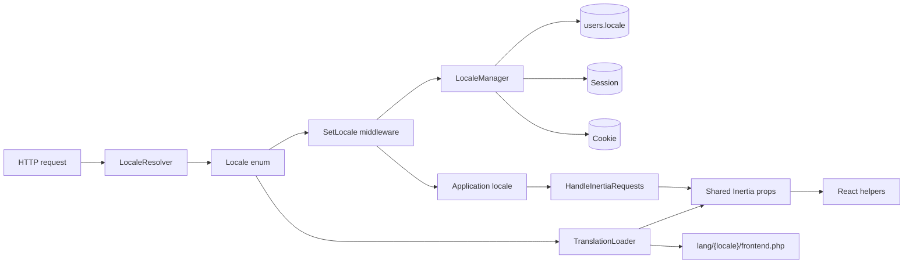
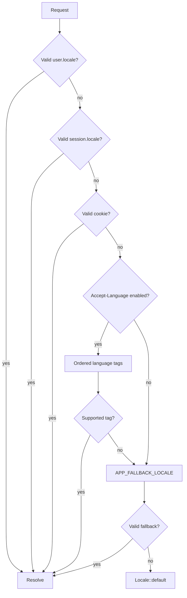
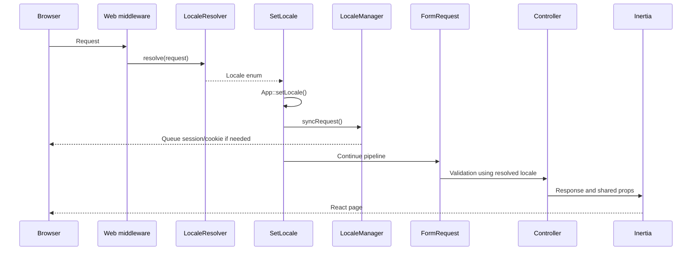
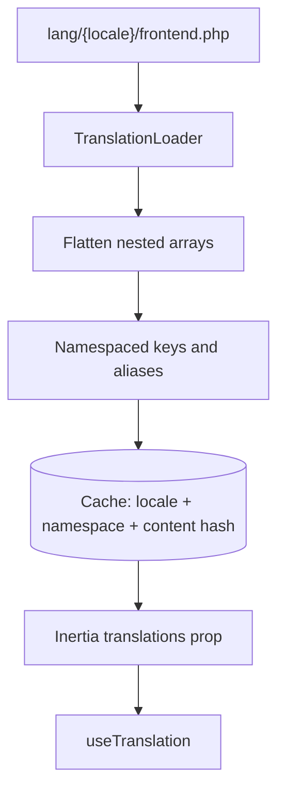

# Locale và translation

Tài liệu này mô tả toàn bộ hệ thống locale của Laravel 13 + Inertia React: kiến trúc, request lifecycle, translation runtime, validation, timezone, test và quy trình thêm ngôn ngữ.

## 1. Mục tiêu và nguyên tắc

- Backend là source of truth cho locale, danh sách locale và translation catalog.
- Locale hợp lệ chỉ được định nghĩa trong App\Enums\Locale.
- Guest có thể nhận locale từ browser/session/cookie nhưng không được lưu vào database.
- Chỉ authenticated user mới được gọi endpoint đổi locale.
- Translation application dùng PHP files; không duy trì JSON/PHP duplicate.
- Validation message do Laravel trả về theo app()->getLocale(); React không dịch lại message lỗi.
- Locale và timezone là hai concern khác nhau.
- Hệ thống không localize URL; locale được quản lý ở request/user preference.

Laravel native hỗ trợ PHP/JSON translation, fallback locale, placeholder và pluralization. Project chọn PHP catalog để key/domain rõ ràng và kiểm tra parity bằng CI. Tham khảo [Laravel Localization](https://laravel.com/framework/docs/13.x/localization).

## 2. Kiến trúc tổng thể



| Thành phần            | Trách nhiệm                            | Không nên làm           |
| --------------------- | -------------------------------------- | ----------------------- |
| Locale                | Enum locale hợp lệ và native label     | Đọc request/cookie      |
| LocaleRegistry        | Metadata, validate value, language tag | Lưu preference          |
| LocaleResolver        | Chọn locale của request                | Mutate session/database |
| SetLocale             | Set application locale, sync request   | Xử lý form update       |
| LocaleManager         | Persistence user/session/cookie        | Tự quyết định locale    |
| TranslationLoader     | Load, flatten, cache PHP catalog       | Validate request locale |
| HandleInertiaRequests | Share locale/timezone/catalog          | Resolve lại locale      |
| useTranslation        | Dịch UI, interpolate, pluralize        | Thay backend validation |
| useLocaleFormat       | Format date/number/currency            | Override timezone       |

### Cấu trúc file

```text
app/Enums/Locale.php
app/Support/Locale/
├── LocaleRegistry.php
├── LocaleResolver.php
├── LocaleManager.php
└── TimezoneResolver.php
app/Support/Translations/TranslationLoader.php
app/Http/Middleware/SetLocale.php
app/Http/Middleware/HandleInertiaRequests.php
app/Http/Controllers/Settings/LocaleController.php
app/Console/Commands/
├── CheckTranslations.php
└── GenerateTranslationTypes.php
lang/{locale}/
├── frontend.php
├── validation.php
├── common.php
├── authorization.php
└── audit.php
resources/js/hooks/
├── use-translation.ts
└── use-locale-format.ts
resources/js/types/generated-locale.ts
```

Support/Locale là nhóm domain service dùng chung cho locale context. TranslationLoader nằm riêng vì quản lý nguồn và cache translation, không quản lý việc chọn locale.

## 3. Nguồn sự thật và shared props

Thêm locale bắt đầu từ App\Enums\Locale. LocaleRegistry tự đọc Locale::cases(), vì vậy React không được khai báo danh sách locale thứ hai.

```php
'supportedLocales' => $this->localeRegistry->all(),
```

Locale::label() là native label, ví dụ English và Tiếng Việt; label không đổi theo locale hiện tại để nhận diện ngôn ngữ đích.

| Prop             | Kiểu                           | Ý nghĩa                                 |
| ---------------- | ------------------------------ | --------------------------------------- |
| locale           | Locale                         | Locale đã resolve cho request           |
| supportedLocales | SupportedLocale[]              | Options cho language switcher           |
| timezone         | string                         | Timezone đã validate, fallback cuối UTC |
| translations     | Record<TranslationKey, string> | Catalog frontend đã flatten             |

Runtime helper vẫn fallback về object rỗng nếu custom response thiếu prop, nhưng response Inertia chuẩn phải cung cấp đầy đủ contract trên.

## 4. Locale resolution



Precedence chính xác:

```text
user.locale
→ session.locale
→ LOCALE_COOKIE_NAME cookie
→ Accept-Language
→ APP_FALLBACK_LOCALE
→ Locale::default()
```

Request::getLanguages() đã sắp xếp language tag theo quality value q. LocaleRegistry normalize dấu gạch ngang thành gạch dưới, thử exact match trước rồi base-language match:

```text
vi-VN → vi
en-US → en
en_GB → en_GB nếu enum có đăng ký en_GB
```

Invalid value bị bỏ qua để thử nguồn kế tiếp; không truyền dữ liệu user-controlled thẳng vào App::setLocale(). Nếu request chưa có session, resolver kiểm tra hasSession() trước khi đọc.

## 5. Request lifecycle và persistence



SetLocale được append sau StartSession và trước validation. Điều này bảo đảm session đọc được, authenticated user được resolve trước controller và Form Request/Fortify tạo đúng validation message.

Trong app hiện tại, Request::user() dùng default web session guard nên có thể resolve user từ session ngay trong SetLocale; route-level auth middleware không phải lúc đó mới làm user xuất hiện. Đây là behavior được regression test bằng trường hợp user locale khác session/cookie. Nếu sau này thêm guard hoặc authentication mechanism khác, phải kiểm tra lại middleware order và resolver contract.

LocaleManager có hai operation:

- syncRequest(): cập nhật session/cookie, không ghi database; chạy cho cả guest.
- updateUser(): lưu preference lâu dài; chỉ gọi từ route đã qua auth.

Route đổi locale là PATCH /settings/locale, dùng Rule::enum(Locale::class). Guest bị redirect và không thể cập nhật users.locale.

Cookie mặc định app_locale nằm ngoài encrypted-cookie list. Nếu đổi LOCALE_COOKIE_NAME, phải cập nhật exception list trong bootstrap/app.php tương ứng.

## 6. Translation backend và React



Backend dùng __() hoặc trans(). React dùng:

```tsx
const { t, td, tc } = useTranslation();

t('auth.login');
t('common.welcome', { name: 'An' });
tc('items', count);
const key = 'errors.' + status + '.title';
td(key);
```

Khi thêm text UI, cập nhật frontend.php của mọi locale. Khi thêm message backend, cập nhật domain PHP tương ứng. Placeholder phải giữ nguyên tên như :count, :attribute, :max.

### t() — static translation

t() dịch một TranslationKey tĩnh và có compile-time checking từ generated type.

```tsx
t('auth.login');
t('Save');
t('common.welcome', { name: 'An' });
t('unknown.key'); // TypeScript error nếu key chưa có
```

Placeholder dạng :name, :count, :attribute được thay từ params. Nếu thiếu key, helper dùng fallback nếu có; nếu không sẽ trả về key và cảnh báo trong development.

### td() — dynamic translation

td() dành cho key được tạo runtime:

```tsx
const key = 'errors.' + status + '.title';
td(key);
```

Compiler không thể chứng minh dynamic key tồn tại, nên phải có runtime test hoặc chuyển về key tĩnh. Không dùng td() thay t() ở key tĩnh.

### tc() — plural translation

tc() chọn plural category bằng Intl.PluralRules rồi tìm key key.<category>:

```tsx
tc('items', count);
```

Catalog:

```php
return [
    'items.one' => ':count item',
    'items.other' => ':count items',
];
```

Locale hiện tại có thể dùng one/other. Locale khác có thể cần zero, few, many hoặc category riêng. Generated type tự thêm root items từ plural keys để gọi tc('items', count) type-safe. Nếu category không tồn tại, helper fallback về key gốc.

### Namespace collision

Loader tạo key namespaced như frontend.auth.login và alias ngắn để tương thích code cũ. Nếu hai namespace có cùng leaf key, loader throw LogicException thay vì phụ thuộc namespace order. Khuyến nghị dùng key namespaced ổn định.

## 7. Generated TypeScript types

```bash
php artisan translations:generate-types
php artisan translations:generate-types --check
```

Command sinh Locale từ Locale::cases() và TranslationKey từ catalog frontend của app.locale. File resources/js/types/generated-locale.ts không được chỉnh sửa thủ công.

Quy trình khi thêm key/locale:

1. Sửa PHP enum/catalog.
2. Chạy generator.
3. Commit file generated cùng source.
4. Chạy --check trong CI.

Generated type tăng type safety frontend nhưng không thay thế backend validation.

## 8. useLocaleFormat() và timezone

```tsx
const { formatDate, formatNumber, formatCurrency } = useLocaleFormat();

formatDate(order.createdAt);
formatNumber(1234567.89);
formatCurrency(250000, 'VND');
```

| Helper                           | Chức năng                                   |
| -------------------------------- | ------------------------------------------- |
| formatDate(value, options?)      | Format ngày theo locale và timezone backend |
| formatNumber(value, options?)    | Format số theo locale                       |
| formatCurrency(value, currency?) | Format tiền tệ, mặc định VND                |

Backend validate timezone bằng timezone_identifiers_list(). React kiểm tra thêm bằng Intl.DateTimeFormat và fallback UTC. formatDate() đặt timeZone sau options caller, nên caller không thể override timezone hệ thống.

## 9. Validation và error page

Validation catalog đặt tại:

```text
lang/en/validation.php
lang/vi/validation.php
```

Luồng:

```text
SetLocale → FormRequest validation → Laravel translated message → Inertia error bag → React
```

React chỉ hiển thị message từ Laravel, không dịch lại errors.email. ValidationException tiếp tục đi qua flow validation chuẩn.

Inertia error page hỗ trợ 403, 404, 419, 429, 500, 503. Exception details không gửi ra frontend; page chỉ dùng status và errors.{status}.* catalog.

## 10. Kiểm tra và test

```bash
php artisan translations:check
php artisan translations:check --locale=vi
php artisan translations:generate-types --check
php artisan test
composer run types:check
npm run check
npm run types:check
npm run build
```

translations:check kiểm tra parity, extra keys, literal key trong .ts/.tsx và namespace collision. Regex checker không chứng minh được dynamic key, alias translator hoặc key ghép runtime; các trường hợp này cần runtime test.

| Nhóm            | Behavior cần test                                        |
| --------------- | -------------------------------------------------------- |
| Resolve         | user, session, cookie, browser, fallback, invalid input  |
| Header          | exact/regional tag, quality values, unsupported language |
| Authorization   | guest bị redirect; authenticated user được update        |
| Persistence     | database, session, cookie, flash toast                   |
| Translation     | parity, nested key, missing literal key                  |
| Cache           | file content đổi thì catalog đổi ngay                    |
| Namespace       | collision fail rõ ràng                                   |
| Formatting      | invalid timezone, timezone không bị override             |
| Error           | status và shared props giữ nguyên                        |
| Generated types | file generated đồng bộ PHP source                        |

## 11. Thêm locale mới

1. Thêm case vào App\Enums\Locale.
2. Thêm lang/{locale}/frontend.php với toàn bộ frontend key.
3. Thêm validation.php và domain catalog cần dùng.
4. Giữ nguyên key và placeholder của locale mặc định.
5. Với regional locale, thống nhất enum value, thư mục và language tag.
6. Bổ sung test exact/base Accept-Language, validation và shared props.
7. Chạy php artisan translations:generate-types.
8. Chạy toàn bộ verification.

Không thêm locale trực tiếp vào React component hoặc resources/js/types/locale.ts.

## 12. Deployment và troubleshooting

```bash
composer install --no-dev --optimize-autoloader
php artisan migrate --force
php artisan translations:check
php artisan translations:generate-types --check
npm ci
npm run build
php artisan optimize:clear
php artisan config:cache
php artisan route:cache
php artisan view:cache
```

Không commit .env chứa secret. LOCALE_TRANSLATION_CACHE_TTL chỉ cấu hình TTL; không cần TRANSLATION_CACHE_VERSION.

### Validation hiển thị tiếng Anh

Kiểm tra users.locale, middleware order, validation.php, placeholder và config cache. Sau đó chạy php artisan translations:check.

### React hiển thị translation key

Kiểm tra frontend.php của mọi locale, chạy checker, regenerate generated types. Với dynamic key, dùng td() và thêm runtime test.

### Ngày giờ bị lỗi

Kiểm tra users.timezone, APP_TIMEZONE là IANA timezone hợp lệ và không truyền timeZone override vào formatDate().

## 13. Quyết định package

Không dùng package localization ngoài Laravel native ở phase này. URL-localization package chỉ cần khi locale nằm trong URL/SEO; database translation loader chỉ cần khi admin chỉnh translation runtime. Implementation nội bộ hiện phù hợp với session/cookie preference, auth boundary, Inertia shared props và validation flow.
